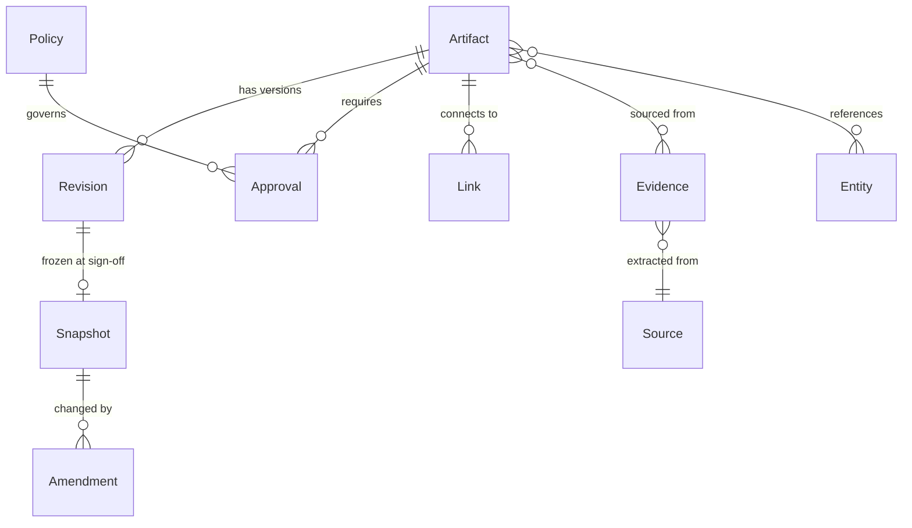
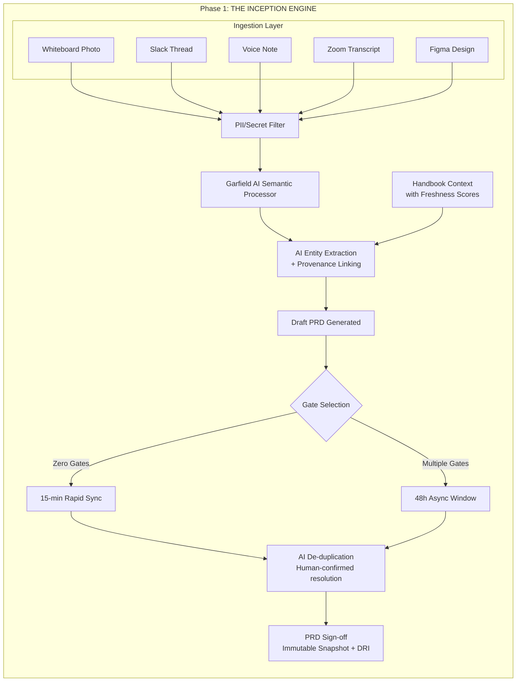
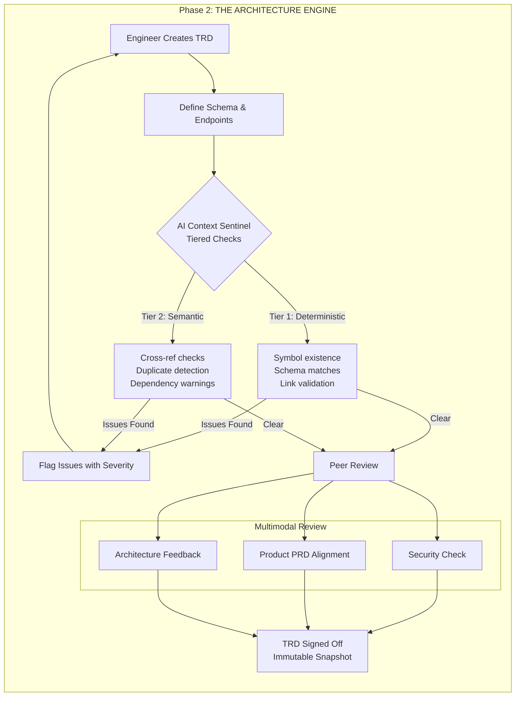
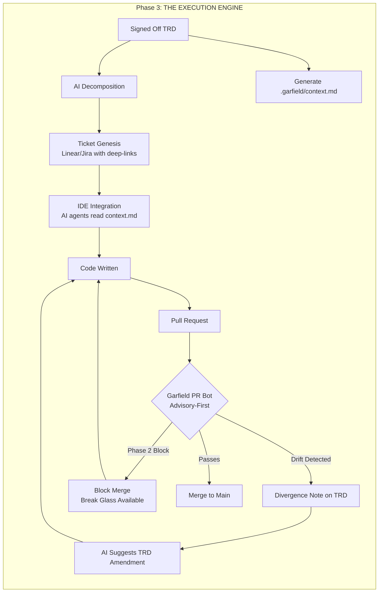
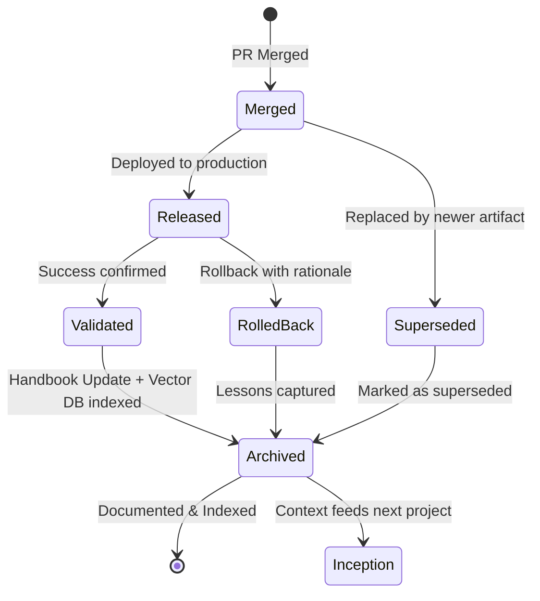
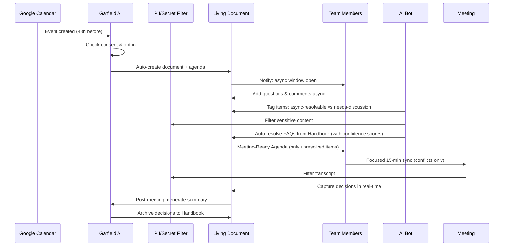
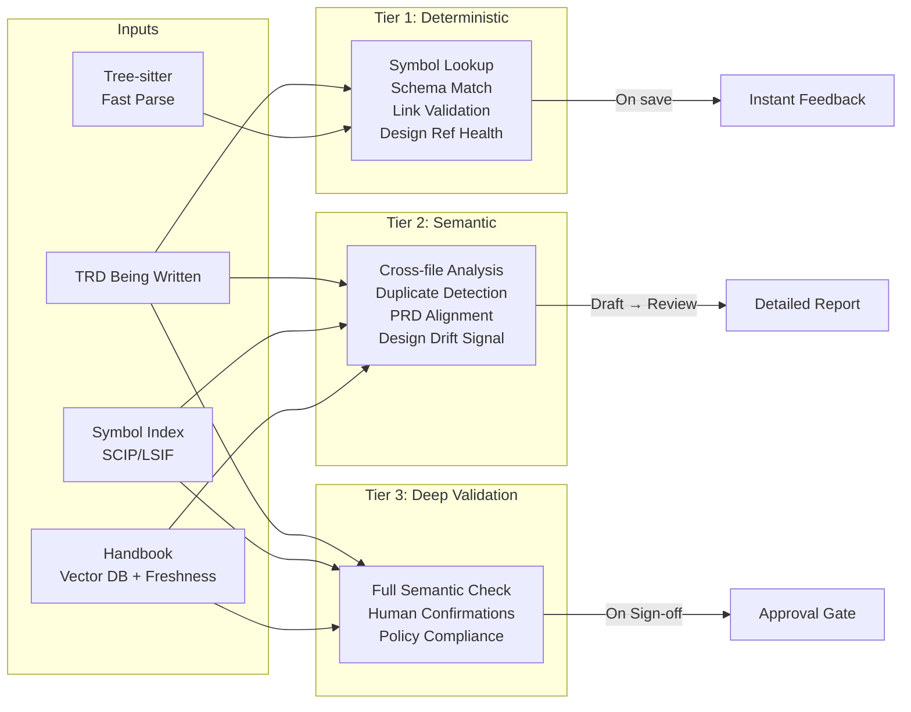
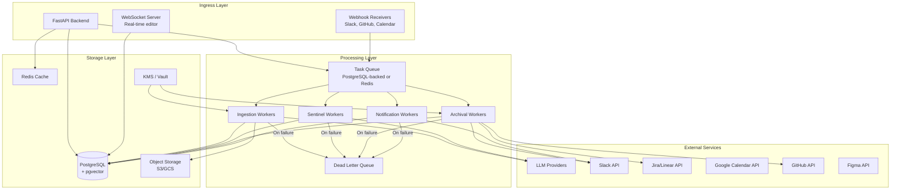

# Garfield: Building a Knowledge Ledger

Garfield is not just an AI note-taker — it is a **Knowledge Ledger** for the engineering lifecycle. A system that captures, validates, and preserves every decision from ideation to production with **immutable provenance, versioned snapshots, and auditable sign-offs**.

Where traditional tools treat documentation as a chore at the end, Garfield makes it a **byproduct of the process itself**. The result is "Code Reviews for PMs" — catching **Semantic Debt** at the source, before it becomes expensive bugs downstream.

> **Semantic Debt** is to product teams what Technical Debt is to codebases. Every meeting decision that isn't captured, every TRD written without codebase context, every ticket created without linking back to the "Why" — that's semantic debt accumulating silently.

This document describes the problem Garfield solves, how it solves it, and the technical architecture behind it.

---

## The Problem: How Companies Work Today

Modern engineering teams suffer from a broken lifecycle. Context leaks at every handoff, and decisions evaporate between phases.

### Inception: Ephemeral Context

A 1-hour meeting where 50% of the room is bored. Decisions happen verbally. Someone takes notes, but they're incomplete. The PM writes a PRD from memory three days later. Slack threads contain critical clarifications that nobody can find. Voice notes sit unlistened. Whiteboard photos are never digitized.

**Result**: The PRD reflects what the PM remembers, not what was decided.

### Architecture & Design: Isolationist TRDs

Engineers write Technical Requirements Documents in silos. The TRD references a service that was renamed two months ago. It proposes a schema that conflicts with an existing migration. Nobody catches it because the TRD reviewer skimmed it between meetings.

This creates **Architecture Drift** — the gap between what's designed and what actually exists in the codebase. It leads to "Code Review Surprises" where fundamental design issues surface only when the PR is already open.

### Execution: Copy-Paste Breakdown

The PM manually breaks down a TRD into Jira or Linear tickets. In translation, the "Why" and "How" are lost. The ticket says "implement notification batching" but doesn't link to the TRD section explaining the rate-limiting constraints. The developer guesses. The AI coding agent guesses harder.

**Result**: Developer uncertainty, context-poor implementation, and bugs that trace back to requirements, not code.

### Knowledge: The Documentation Graveyard

PRDs and TRDs are written, approved, and never looked at again. Six months later, a new engineer asks "why did we choose PostgreSQL over DynamoDB?" and nobody remembers. The handbook is stale. Onboarding takes weeks because institutional knowledge lives in people's heads, not in searchable documentation.

**Result**: Repeated decision-making, slow onboarding, and an organization that forgets faster than it learns.

---

## Core Objects & Ledger Model

The Knowledge Ledger is built on a well-defined data model. Every piece of information in Garfield maps to one of these core primitives.

### Entities

| Entity | Description | Examples |
|--------|-------------|----------|
| **Artifact** | A versioned document with lifecycle state | PRD, TRD, DecisionRecord, Ticket, Retro |
| **Evidence** | A source input with provenance metadata | Transcript segment (with timestamp + speaker), Slack permalink, whiteboard image, commit SHA, Figma frame reference (file_key + node_id + label) |
| **Entity** | A named thing in the codebase or system | Service, endpoint, schema, table, feature flag, KPI |
| **Link** | A typed, directed edge between any two objects | `implements`, `supersedes`, `depends_on`, `decided_by`, `contradicts` |
| **Approval** | A sign-off record | Who, when, which artifact version, cryptographic hash, policy satisfied |
| **Policy** | A gating rule for state transitions | "Requires 2 engineer approvals + 1 PM approval to move TRD from Review → Approved" |

### Stable Identifiers

Every object has a **stable ID** that survives edits and restructuring:

- **Artifacts** get monotonic IDs: `PRD-2024-001`, `TRD-2024-015`
- **Sections** within artifacts get **anchor IDs** (e.g., `TRD-2024-015#auth-flow`) that survive reorganization via content-hash fallback
- **Evidence** links always include source provenance: transcript timestamp, Slack permalink, image region coordinates, speaker attribution

### Design References

`DesignReference` is a specialized Evidence type for linking UI designs to PRD/TRD sections. It is provider-agnostic via the `DesignArtifactProvider` interface — Figma is the first implementation, with Sketch/XD addable later.

**Structured fields**:
- `provider`: design tool identifier (e.g., `figma`, `sketch`)
- `url`: full URL to the design file/frame
- `file_key`: provider-specific file identifier
- `node_id`: specific frame/component/page identifier
- `label`: human-readable description (e.g., "Onboarding flow — Step 3")
- `rationale`: why this design is linked (e.g., "UI spec for auth screen")
- `linked_by`: who attached it, when
- `snapshot_at_signoff`: frozen metadata captured at TRD/PRD sign-off (thumbnail URL, last-modified timestamp, node name, page name)

Design references link specific frames/components to PRD/TRD sections via stable anchor IDs. Garfield stores **pointers** (file_key + node_id) and minimal metadata — never full design files. Enrichment (preview thumbnails, component names, last-modified timestamps) is fetched **on-demand** via the `DesignArtifactProvider`, not by polling or crawling.

When no design tool API is connected, users can still attach design URLs with manually entered labels and optionally upload screenshots — the system degrades gracefully.

### Versioning & Immutability

Artifacts follow an **append-only version model**:

1. Every save creates a new **revision** (lightweight, diffable)
2. On **sign-off**, the current revision is frozen into an **immutable snapshot** with a cryptographic hash
3. Any change after sign-off creates an **Amendment** — a new revision with explicit diff, rationale, and fresh approval cycle
4. The full revision history is always available; snapshots are never mutated

```
Revision 1 (draft) → Revision 2 → ... → Revision N → [SIGN-OFF: Snapshot v1, hash: abc123]
                                                          ↓
                                              Amendment 1 (diff + rationale + new approvals)
                                                          ↓
                                              [SIGN-OFF: Snapshot v2, hash: def456]
```

### Canonical Events

The ledger records an immutable event stream for audit and traceability:

| Event | Trigger | Data |
|-------|---------|------|
| `ArtifactCreated` | New PRD/TRD/etc. | Template, author, source evidence |
| `RevisionSaved` | Any edit | Diff, author, timestamp |
| `ReviewRequested` | State → Review | Reviewers, deadline |
| `ApprovalGranted` | Reviewer approves | Reviewer, version hash, policy |
| `SignedOff` | All approvals met | Immutable snapshot hash, approvers, policy |
| `AmendmentProposed` | Post-sign-off edit | Diff, rationale, required approvers |
| `DriftDetected` | Code diverges from TRD | PR reference, TRD section, severity |
| `DivergenceAccepted` | Drift resolved by updating TRD | New TRD revision, code reference |
| `TicketsGenerated` | TRD decomposed | Ticket IDs, TRD section mappings |
| `DesignReferenceAttached` | Design linked to artifact section | Provider, file_key, node_id, label, target artifact + section anchor |
| `DesignDriftDetected` | Design changed since sign-off | DesignReference ID, last-modified at sign-off vs current, artifact version |
| `Archived` | PR merged + archival | Archive location, final snapshot hash |

### Entity-Relationship Overview



---

## The Garfield Solution: Four Engines

Garfield addresses each broken phase with a dedicated engine. Together, they form a continuous loop where the output of each phase feeds the next.

### The Inception Engine (Ideation & Context Ingestion)

The Inception Engine replaces ephemeral meetings with structured capture. It is not merely a note-taker — it produces **governed, validated, and linked artifacts** from raw inputs.

**Capture-First Ingestion** — every interaction is a valid data source:
- Whiteboard photos (OCR + entity extraction)
- Slack threads (threaded context preservation)
- Zoom/Google Meet transcripts (speaker-tagged decisions)
- Voice notes (transcription + intent classification)
- Design files (Figma frame links with embedded previews — via `DesignArtifactProvider`)

All inputs flow through the **PII/Secret Filter** (see [Security & Compliance](#security-privacy--compliance)) before reaching the **Garfield AI Semantic Processor**, which extracts entities (features, constraints, stakeholders, dependencies) and cross-references them against the existing Handbook. A structured **Draft PRD** is generated automatically with **provenance links** back to source evidence.

**Adaptive Gates** adapt to the organization's maturity (see [Configurable Gates](#configurable-gates-replacing-startup-vs-mnc-modes)):

| Gates Configured | Format | Output | AI Role |
|-----------------|--------|--------|---------|
| Zero gates (startup) | 15-min Rapid Sync with live transcription | Immediate Draft PRD | Real-time entity extraction |
| Multiple gates (enterprise) | 48h Async Window via Slack/Teams | Draft PRD after async review | De-duplication + FAQ resolution |

**AI De-duplication** resolves incoming questions from the existing Handbook before they become meetings. Resolution is defined precisely:
- **Resolved**: The AI found a handbook entry with a **freshness score ≥ 0.7** and **confidence score ≥ 0.8** that directly answers the question, AND the user confirmed the answer (or did not dispute it within the async window)
- **Unresolved**: Confidence below threshold, handbook entry stale, user disputed, or no match found

Early deployments should expect **low resolution rates** (20-30%) with human-in-the-loop confirmation, improving as the ledger grows and handbook entries are validated. The ~70% target is an aspirational KPI for mature deployments.

The phase ends with **PRD Sign-off** — an immutable snapshot with approver signatures — and a Directly Responsible Individual (DRI) assigned.



**AI Design Suggestions**: When a PRD references UI screens, flows, or visual components, the AI Semantic Processor can auto-suggest "attach Figma link" — prompting the author to link the relevant design frames before sign-off.

---

### The Architecture Engine (Design & Validation)

The Architecture Engine turns the TRD from a static document into a **living logic check**.

As the engineer writes a TRD, the **AI Context Sentinel** validates the document against the actual codebase and existing documentation using a **tiered check system** (see [Context Sentinel Deep-Dive](#the-context-sentinel-deep-dive)).

After the Sentinel clears, the TRD enters **Multimodal Peer Review** across three tracks:
- **Security Check** — surface area and vulnerability assessment
- **Product PRD Alignment** — does the TRD implement what the PRD specified?
- **Architecture Feedback** — structural and pattern review from peers

The TRD is "Signed Off" only after all review tracks clear — producing an immutable snapshot with approver signatures.



---

### The Execution Engine (Implementation & Tracking)

The Execution Engine eliminates the copy-paste breakdown between design and implementation.

**Semantic Ticket Genesis** — when a TRD is signed off, AI decomposes it into tickets that are **Context Blobs**, not flat descriptions. Each ticket contains:
- **The What**: Task description
- **The Why**: Deep-link to the originating PRD section (via stable anchor IDs)
- **The How**: Deep-link to the specific TRD section (via stable anchor IDs)
- **The Design**: Deep-link to the specific Figma frame/component (via stable `DesignReference`)
- **Constraints**: Referenced directly from the TRD

Tickets are created in Linear or Jira with deep-link URIs back to the TRD sections.

**IDE Integration via `.garfield/context.md`** — rather than relying on deep-link traversal that AI coding agents can't follow, Garfield generates a `.garfield/context.md` file in the repository when a TRD is signed off. This file contains the relevant technical specs, schema definitions, API contracts, constraints from the TRD, and relevant design references (frame names, component names, Figma URLs) in a format that Cursor, GitHub Copilot, and other AI coding agents can directly consume from the repo.

**Garfield PR Bot (Advisory-First)** — on pull request submission, the bot runs validation checks. It starts **advisory-only** and escalates enforcement gradually:

- **Phase 1 (Advisory)**: Traceability enforcement (ticket ↔ TRD ↔ PRD links required), schema/API diff checks, "docs updated" checklists. Posts comments but does not block.
- **Phase 2 (Selective Enforcement)**: Blocks only on high-confidence, machine-verifiable violations (e.g., missing ticket link, schema field removed without migration).
- **Break Glass**: Any merge block can be overridden by an explicit approver from a configured list, with full audit trail.

**Reverse-Sync (Code → TRD Propagation)** — engineering is cyclical, not linear. When code diverges from the TRD:
1. The PR Bot detects the drift and posts a **Divergence Note** on the TRD
2. AI suggests a text update to the TRD that matches the new code reality
3. The TRD author (or DRI) reviews and accepts/modifies the amendment
4. The amendment goes through the standard approval cycle
5. If the divergence is accepted without TRD update, it is recorded as an explicit `DivergenceAccepted` event with rationale

This prevents the Knowledge Ledger from becoming the very "documentation graveyard" it claims to solve.



---

### The Knowledge Engine (Governance & Archiving)

The Knowledge Engine prevents the Documentation Graveyard by making archiving automatic and configurable.

**Configurable Archiving** — on PR merge, Garfield strips drafting noise from the TRD, converts it to clean Markdown, and archives it. The archive destination is configurable per organization:
- **Git commit** to `/docs` folder (default)
- **Separate docs repository** (for orgs with strict CODEOWNERS)
- **Confluence/Notion export** (for orgs using those as doc platforms)
- **Garfield internal portal** (hosted knowledge base)

Sensitive information is filtered before archival based on the document's privacy annotations.

**Artifact Lifecycle Beyond Merge** — merging code doesn't mean the work is done. Artifacts track states beyond merge:
- `Merged` → `Released` → `Validated` (experiment results confirmed)
- `Merged` → `Released` → `Rolled Back` (with rollback rationale)
- `Merged` → `Superseded` (by a newer artifact)

**Self-Healing Brain** — the archived document is immediately indexed in the Vector DB with a **freshness score**. This closes the loop: the next time someone starts a new project (Phase 1), the Inception Engine's AI Semantic Processor can draw on this knowledge to answer questions, detect duplicates, and provide context — while surfacing stale entries for revalidation.

**Audit Trail & Metrics** — captures SLA promised vs. actual delivery time. A Retrospective Doc is auto-generated comparing the original PRD timeline against reality. The full event stream provides a complete audit history.



---

## The Universal Lifecycle

All four engines connect in a continuous loop. The output of each phase is the input to the next, and the Knowledge Engine feeds back into Inception for the next project.

```mermaid
graph TD
    subgraph Phase_1["Phase 1: THE INCEPTION ENGINE"]
        direction TB
        IN_OFF[In-Office Session] & IN_REM[Remote / Async] & IN_DIR[Direct Input] & IN_FIG[Figma Design] --> PII_F[PII/Secret Filter]
        PII_F --> GP[Garfield Processor]
        GP --> AEE[AI Entity Extraction]
        HB_CTX[Handbook Context<br/>with Freshness Scores] --> AEE
        AEE --> DPRD[Draft PRD]
        DPRD --> GATE{Gate Config}
        GATE -->|Zero Gates| FAST[15-min Rapid Sync]
        GATE -->|Multiple Gates| SLOW[48h Async Window]
        FAST & SLOW --> DEDUP[AI De-duplication<br/>Human-confirmed]
        DEDUP --> PRD_SO[PRD Sign-off<br/>Immutable Snapshot + DRI]
    end

    subgraph Phase_2["Phase 2: THE ARCHITECTURE ENGINE"]
        direction TB
        TRD_C[Engineer Creates TRD] --> SCHEMA[Schema & Endpoints]
        SCHEMA --> SENT{AI Context Sentinel<br/>Tiered Checks}
        SENT -->|Issues| SENT_FL[Flag with Severity]
        SENT_FL --> TRD_C
        SENT -->|Clear| PEER[Peer Review]
        PEER --> SEC[Security] & PPRD[Product PRD] & PEERS[Architecture]
        SEC & PPRD & PEERS --> TRD_SO[TRD Signed Off<br/>Immutable Snapshot]
    end

    subgraph Phase_3["Phase 3: THE EXECUTION ENGINE"]
        direction TB
        DECOMP[AI Decomposition] --> TICKETS[Linear/Jira Tickets<br/>with stable anchor links]
        CTX_GEN[Generate .garfield/context.md]
        TICKETS --> IDE_INT[IDE Integration]
        CTX_GEN --> IDE_INT
        IDE_INT --> AI_CODE[AI Agent reads context.md]
        AI_CODE --> CODE[Code]
        CODE --> PR_VAL{Garfield PR Bot<br/>Advisory-First}
        PR_VAL -->|Drift| RSYNC[Reverse-Sync:<br/>Divergence Note + TRD Amendment]
        RSYNC --> CODE
        PR_VAL -->|Valid| MERGE[Merge]
    end

    subgraph Phase_4["Phase 4: THE KNOWLEDGE ENGINE"]
        direction TB
        IMPL[Implementation Complete] --> SIGN[Post-Merge Lifecycle<br/>Released / Validated / Rolled Back]
        SIGN --> HB_UPD[Configurable Archival<br/>Git / Confluence / Notion / Portal]
        HB_UPD --> FRESH[Freshness Scoring<br/>+ Vector DB indexed]
        FRESH --> LIVE[Project Documented & Indexed]
    end

    Phase_1 -.-> Phase_2
    Phase_2 -.-> Phase_3
    Phase_3 -.-> Phase_4
    Phase_4 -.->|Context for next project| Phase_1

    style GP fill:#4A90D9,color:#fff
    style SENT fill:#E67E22,color:#fff
    style PR_VAL fill:#E67E22,color:#fff
    style HB_UPD fill:#27AE60,color:#fff
    style LIVE fill:#27AE60,color:#fff
```



---

## The Async-First Meeting Flow

Garfield transforms meetings from information-transfer sessions into focused conflict-resolution syncs. The bulk of alignment happens asynchronously before anyone enters a room.

**Consent & Privacy**: Before auto-creating documents from calendar events, Garfield checks that:
1. The meeting organizer has opted in to Garfield integration
2. All participants have accepted the org's Garfield data policy
3. Recording/transcription consent is obtained per jurisdiction requirements (see [Security & Compliance](#security-privacy--compliance))



**Pre-Meeting (48h before)**: Garfield auto-creates a document from the calendar event (with consent), suggests an agenda, and opens an async window. Team members add questions and comments. The AI tags items as "async-resolvable" vs "needs-discussion" and resolves FAQs from the Handbook — showing confidence scores so users can verify.

**During Meeting**: Only unresolved items make the agenda. A 15-minute focused sync replaces the 1-hour status update. Decisions are captured in real-time to the living document.

**Post-Meeting**: AI generates a summary, extracts action items, and archives decisions to the Handbook.

---

## The Context Sentinel Deep-Dive

The Context Sentinel is Garfield's design validator. It operates during TRD authoring using a **tiered architecture** that balances cost, latency, and accuracy.

### Tiered Check Architecture

| Tier | Trigger | Checks | Cost | Latency |
|------|---------|--------|------|---------|
| **Tier 1: Deterministic** | On every save / 30s debounce | Symbol existence via prebuilt index, schema name matches, link validation, required section presence, design reference link health (URL valid, accessible) | Negligible | < 200ms |
| **Tier 2: Semantic** | On state transition (Draft → Review) | Cross-file dependency analysis, duplicate detection, handbook cross-reference, PRD alignment, design drift signal (design last-modified > TRD sign-off timestamp) | Medium (Vector DB + LLM) | 5-30s |
| **Tier 3: Deep Validation** | On Sign-off | Full semantic analysis, required human confirmations, policy compliance check | High (LLM-heavy) | 30s-2min |

### Symbol Resolution: LSP/SCIP, Not Just Tree-sitter

Tree-sitter builds a **Concrete Syntax Tree (CST)** — excellent for fast structural parsing within a single file. However, claims like "You referenced `NotificationService.sendBatch()` but that method doesn't exist" require **cross-file symbol resolution** and **type analysis** that Tree-sitter alone cannot provide.

The Sentinel uses a layered approach:

| Tool | Role | When Used |
|------|------|-----------|
| **Tree-sitter** | Fast structural parsing, syntax extraction, identifier listing | Tier 1: every save |
| **SCIP index** (or LSIF) | Cross-file symbol resolution, type information, call graphs | Tier 2: on state transition (prebuilt, updated on push) |
| **LSP** | On-demand deep analysis for specific references | Tier 3: sign-off validation |

The SCIP index is built on every push to the repository and cached. This avoids expensive real-time cross-file analysis while providing accurate symbol resolution when needed.

### Inputs & Outputs

**Inputs**:
- **TRD Being Written** — the live document content
- **Prebuilt Symbol Index** — SCIP/LSIF index of the codebase, updated on push
- **Handbook Vector DB** — all approved PRDs and TRDs, indexed alongside code documentation, with freshness scores

**Outputs**:
- **Entity Conflict** (blocks TRD approval) — a referenced entity doesn't exist or doesn't match the spec
- **Dependency Warning** (surfaces for resolution) — e.g., "you referenced `NotificationService.sendBatch()` but that method doesn't exist in the current codebase"
- **Duplicate Detection** (surfaces for decision) — e.g., "this logic already exists in `wire-pipeline-v2`"
- **Freshness Warning** — a referenced handbook entry has a low freshness score and may be outdated
- **Clear** — no issues found, proceed with peer review



---

## Configurable Gates (Replacing Startup vs MNC Modes)

Rather than separate "Startup" and "MNC" modes, Garfield uses **configurable gates** — a unified data model where organizations configure the number and strictness of quality gates. A startup that grows into an enterprise simply adds gates; it doesn't switch modes.

### Gate Configuration

| Gate | Description | Default (Startup) | Enterprise Example |
|------|-------------|-------------------|-------------------|
| **PRD Async Window** | Time for async review before sync | 0 (skip) | 48h |
| **PRD Approval Quorum** | Required approvers for PRD sign-off | 1 (DRI only) | 2 PMs + 1 Eng Lead |
| **TRD Sentinel Tier** | Highest tier of Sentinel checks required | Tier 1 only | All three tiers |
| **TRD Approval Quorum** | Required approvers for TRD sign-off | 1 (Tech Lead) | 2 Engineers + 1 Architect + Security |
| **PR Bot Mode** | Advisory or enforcement | Advisory only | Selective enforcement |
| **Archival Review** | Whether archived docs need review | Auto-archive | Manual review before archive |
| **SLA Timers** | Response time requirements | None | Per-document-type SLAs |
| **Compliance Checks** | Regulatory requirements | None | SOC2 / ISO27001 controls |

### Context Parity

The key design principle: **"If it's not in Garfield, it didn't happen."**

The Universal Ingestion layer ensures that regardless of source — whiteboard, Zoom, Slack, or Loom — the output is a standardized PRD. This creates context parity between in-office and remote teams. The startup team that jams on a whiteboard produces the same structured artifact as the enterprise team that threads a Slack discussion over 48 hours.

The gate configuration is stored per-organization and can be updated at any time. Changing gates does not require data migration — the same artifact model supports zero gates and twenty gates alike.

---

## Security, Privacy & Compliance

Garfield ingests **highly sensitive data** — Slack messages, Zoom transcripts, voice notes, codebases, and internal documents. Security is a first-class architectural concern, not an afterthought.

### Threat Model

| Threat | Vector | Mitigation |
|--------|--------|------------|
| **PII/Secret Exposure** | Transcripts contain AWS keys, customer data, HR info | PII/Secret Filter middleware in Inception Engine (see below) |
| **Unauthorized Access** | User sees content they shouldn't | Permission mirroring + RBAC (see below) |
| **Prompt Injection** | Malicious content in ingested Slack/docs poisons RAG | Input sanitization + strict tool boundaries (see below) |
| **LLM Data Egress** | Sensitive content sent to hosted LLM providers | Data classification + routing rules (see below) |
| **Token Compromise** | OAuth tokens for Slack/Jira/Google leaked | KMS-backed storage + rotation + least privilege (see below) |
| **Consent Violation** | Recording/transcription without consent | Explicit opt-in flows per jurisdiction (see below) |

### PII/Secret Filter Middleware

All ingested content passes through a **PII/Secret Filter** before any processing:

```
Raw Input → PII/Secret Filter → Garfield AI Processing
```

The filter:
1. **Secret detection**: Regex + entropy-based scanning for API keys, tokens, passwords, connection strings (similar to git-secrets / truffleHog)
2. **PII detection**: Named entity recognition for names, emails, phone numbers, addresses, SSNs
3. **Action on detection**: Redact, flag for human review, or reject — configurable per content type and org policy
4. **Audit log**: Every detection event is logged with content hash (not content) for compliance

### Access Control

**Permission Mirroring**: Garfield never shows content the user couldn't access in the source system. If a user can't see a Slack channel, they can't see evidence extracted from that channel.

**RBAC Model**:

| Role | Permissions |
|------|------------|
| **Viewer** | Read artifacts they have access to |
| **Contributor** | Edit drafts, add comments, propose amendments |
| **Reviewer** | Approve/reject at review gates |
| **Admin** | Configure gates, manage integrations, manage users |
| **Org Admin** | Tenant configuration, compliance settings, audit access |

**Document-level permissions**: Beyond roles, individual artifacts can have explicit access lists. Sensitive PRDs (e.g., M&A, layoffs) can be restricted to named individuals.

**SSO/SAML/SCIM**: Required for enterprise deployment. Garfield integrates with identity providers for single sign-on, automated provisioning/deprovisioning, and group-based access.

### Tenant Isolation

For multi-tenant (SaaS) deployment:
- **Row-Level Security (RLS)** in PostgreSQL for data isolation
- **Separate embedding namespaces** in the vector DB per tenant
- **Tenant-scoped encryption keys** via KMS
- **No cross-tenant data leakage** in LLM context windows — each tenant's queries are isolated

### LLM Data Handling

| Data Classification | Routing | Example |
|-------------------|---------|---------|
| **Public** | Any LLM provider | Open-source project TRDs |
| **Internal** | Provider with "no training" agreement + DPA | Standard PRDs/TRDs |
| **Confidential** | Self-hosted model only | M&A docs, HR, financial |
| **Restricted** | No LLM processing | Raw PII, credentials |

All LLM interactions:
- Use the minimum context needed (not entire documents)
- Strip PII before sending (where possible)
- Log prompt/response metadata (not content) for audit
- Respect regional processing requirements (EU data stays in EU)

### Prompt Injection Defense

RAG over untrusted inputs (Slack threads, external docs) is a prompt injection vector:
- **Input sanitization**: Strip control characters, detect prompt injection patterns
- **Strict tool boundaries**: LLM can only call defined tools, never execute arbitrary actions
- **Output validation**: LLM responses are validated against expected schema before presentation
- **Content provenance**: All AI-generated content is labeled as such; users always see source evidence

### Secrets Management

OAuth tokens for integrations (Slack, Jira, Google, GitHub):
- Stored in **KMS-backed secret store** (AWS KMS, GCP KMS, or HashiCorp Vault)
- **Automatic rotation** on configurable schedule
- **Least privilege scopes** — request only the permissions needed
- **Audit log** for all token usage
- **Revocation** on integration disconnect or user deprovisioning

### Consent Framework

- **Meeting transcription**: Requires explicit opt-in from the meeting organizer AND notification to all participants
- **Slack ingestion**: Requires workspace admin approval + channel-level opt-in
- **Voice notes**: Consent implied by intentional upload; transcription notice displayed
- **Calendar sync**: Opt-in per user; auto-doc creation requires organizer consent
- All consent records are stored immutably for compliance audit

---

## Operational Architecture

### System Components



### Failure Modes & Degraded Operation

| Failure | Impact | Mitigation |
|---------|--------|------------|
| **LLM provider down** | AI features unavailable | Graceful degradation: deterministic checks still run, AI features show "temporarily unavailable", queue work for retry |
| **Slack/Zoom API down or rate-limited** | Ingestion delayed | Exponential backoff + dead letter queue; users notified of delay |
| **Design tool API unavailable** | Enrichment/drift detection unavailable | Graceful degradation: design references remain as URL + manual metadata; enrichment queued for retry |
| **Vector DB stale/corrupted** | Semantic search returns poor results | Freshness scoring flags stale results; full re-index on corruption detection |
| **Object storage unavailable** | Can't store transcripts/images | Queue uploads for retry; in-flight processing uses local buffer |
| **PR Bot blocks incorrectly** | Developer frustrated, velocity blocked | Break glass override (see Execution Engine); all blocks are logged and reviewable |
| **Webhook deduplication failure** | Duplicate processing | Idempotency keys on all webhook handlers; dedup table with TTL |

### Idempotency & Reliability

- **Webhook handlers**: Every webhook includes an idempotency key. Processing is at-least-once with deduplication.
- **Background jobs**: All workers are idempotent. Jobs can be safely retried on failure.
- **Dead letter queue**: Failed jobs after max retries go to DLQ for manual inspection and replay.
- **Health checks**: Each component exposes `/health` endpoints for orchestration.

### Monitoring & SLIs

| SLI | Target SLO |
|-----|-----------|
| Webhook processing latency (p99) | < 30s |
| Sentinel Tier 1 check latency | < 500ms |
| Sentinel Tier 2 check latency | < 30s |
| Document save latency | < 200ms |
| API availability | 99.9% |
| LLM request success rate | > 95% (with graceful degradation) |

---

## Freshness & Confidence Scoring

Every piece of knowledge in Garfield has two scores that determine its trustworthiness:

### Freshness Score (0.0 - 1.0)

Measures how current the information is likely to be:

| Factor | Weight | Description |
|--------|--------|-------------|
| **Time since last validation** | 0.3 | Decays over time; reset when a human confirms content is current |
| **Code reality alignment** | 0.3 | Does the referenced code still exist and match? (SCIP index check) |
| **Dependent artifact status** | 0.2 | If the PRD this TRD implements was superseded, freshness drops |
| **Edit recency** | 0.2 | Recently edited content is fresher |

Handbook entries with freshness < 0.5 are flagged for revalidation. Entries < 0.3 are excluded from AI de-duplication answers.

### Confidence Score (0.0 - 1.0)

Measures how reliable an AI-generated output is:

| Factor | Description |
|--------|-------------|
| **Source evidence strength** | Multiple independent sources > single source |
| **Human confirmation** | Human-verified outputs get confidence boost |
| **Retrieval relevance** | How closely the retrieved context matches the query |
| **Model self-assessment** | LLM's own confidence signal (calibrated) |

All AI-generated content displays its confidence score. Users can filter by confidence threshold.

---

## The Transformation Summary

| Dimension | Standard Lifecycle | Garfield Lifecycle |
|---|---|---|
| **Meeting Goal** | Information transfer (status updates) | Conflict resolution only |
| **Source of Truth** | Loudest person in the room | Garfield Knowledge Ledger |
| **Bug Discovery** | Code Review / QA | TRD Design stage (Context Sentinel) |
| **Documentation** | Chore at project end | Byproduct of the process |
| **AI Utility** | Generic code completion | Context-aware architecture validation |
| **Decision Provenance** | Lost in Slack threads | Immutable event stream with source links |
| **Document Versioning** | Overwritten Google Docs | Immutable snapshots with amendment trails |
| **Code↔Design Sync** | One-way (design → code) | Bidirectional (reverse-sync on drift) |

### Key Workflow Stages

| Stage | Description | AI Role |
|---|---|---|
| **Ingestion** | Capture all inputs, filter PII, produce Draft PRD | Semantic Processor, Entity Extraction, PII Filter |
| **Sentinel** | Tiered TRD checks vs codebase | Tree-sitter (Tier 1) + SCIP (Tier 2) + LLM (Tier 3) |
| **Genesis** | TRD decomposed into context-rich tickets | AI Decomposition |
| **Drift Check** | PR validation + reverse-sync | Garfield PR Bot (advisory-first) |
| **Archiving** | Configurable archival + Vector DB indexing | Auto-archive + freshness scoring |

---

## Evaluation & Quality Metrics

Each engine has measurable KPIs to track whether Garfield is delivering value:

### Inception Engine

| Metric | Target | Measurement |
|--------|--------|-------------|
| De-duplication resolution rate | 20% → 70% (over 12 months) | Questions resolved from handbook / total questions |
| PRD creation time | < 2 days from meeting | Timestamp: meeting end → PRD sign-off |
| Evidence coverage | > 80% | PRD sections with linked evidence / total sections |

### Architecture Engine

| Metric | Target | Measurement |
|--------|--------|-------------|
| Sentinel true positive rate | > 90% | Valid flags / total flags |
| Sentinel false positive rate | < 10% | Invalid flags / total flags |
| Design issues caught pre-code | > 50% | Issues found in TRD review / total issues |
| Sentinel check adoption | > 80% of TRDs | TRDs with Sentinel enabled / total TRDs |

### Execution Engine

| Metric | Target | Measurement |
|--------|--------|-------------|
| Ticket→TRD traceability | 100% | Tickets with TRD links / total tickets |
| PR Bot false block rate | < 5% | Break glass invocations / total blocks |
| Reverse-sync adoption | > 60% | Divergences with TRD amendments / total divergences |
| `.garfield/context.md` usage | Track | AI agent references to context.md in commits |

### Knowledge Engine

| Metric | Target | Measurement |
|--------|--------|-------------|
| Archive completeness | > 90% | Merged PRs with archived TRDs / total merged PRs |
| Handbook freshness (avg) | > 0.6 | Average freshness score across handbook entries |
| Search success rate | > 70% | Queries that return useful results / total queries |
| Onboarding time reduction | > 30% | New engineer time-to-first-PR (before/after) |

---

## Technical Architecture Overview

| Layer | Technology | Purpose |
|---|---|---|
| **Backend** | FastAPI (Python) | AI/LLM integration, async task handling |
| **Frontend** | Next.js (TypeScript) + Tailwind + Shadcn/UI | Dashboard, document editor |
| **Database** | PostgreSQL with pgvector | Structured data + semantic embeddings (single vector store for MVP) |
| **Document Editor** | TipTap | Rich-text editing with custom extensions |
| **LLM Orchestration** | LangChain or LlamaIndex | Prompt management, RAG pipelines |
| **Code Parsing (Syntax)** | Tree-sitter | Fast AST parsing for Tier 1 Sentinel checks |
| **Code Parsing (Symbols)** | SCIP index (or LSIF) | Cross-file symbol resolution for Tier 2/3 checks |
| **Object Storage** | S3 / GCS | Transcripts, images, voice notes, attachments |
| **Cache** | Redis | Session cache, rate limiting, prebuilt index cache |
| **Task Queue** | PostgreSQL-backed (or Redis-backed) | Background job processing with dead letter queue |
| **Secrets** | AWS KMS / GCP KMS / HashiCorp Vault | OAuth tokens, API keys, encryption keys |
| **Workflow Engine** | Temporal.io (backend orchestration) + XState (frontend UI state) | Temporal: durable backend workflows with retries; XState: document editor state machines |
| **Calendar Sync** | Google Calendar API | Auto-create documents from events (with consent) |
| **Ticket Integration** | Linear API / Jira API | Semantic Ticket Genesis |
| **Design Integration** | Figma REST API (first provider) | Design references, previews, drift detection via `DesignArtifactProvider` interface |
| **Identity** | SSO/SAML/SCIM | Enterprise authentication and provisioning |

**Note on Vector DB**: For MVP, use **pgvector** as the single vector store — it simplifies operations by keeping embeddings alongside structured data, avoids sync drift, and is sufficient for initial scale. Evaluate dedicated vector DBs (Pinecone, Milvus) only if pgvector performance becomes a bottleneck at scale.

**Note on Workflow Engine**: Temporal.io and XState solve different problems and are complementary. Temporal handles durable backend orchestration (retries, saga patterns, long-running workflows). XState manages frontend/application state machines (document editor states, UI transitions). Both are needed.

---

## Implementation Roadmap

The roadmap is **re-sequenced to validate value sooner** — starting with traceability and deterministic checks before investing in heavy AI features.

### Phase 1: Foundation & Traceability (MVP)

**Goal**: Establish the core document lifecycle with manual workflows and basic linking.

- TipTap editor with custom status dropdown
- Document state machine with configurable gates (not fixed linear flow):
  - Core states: `Draft`, `In Review`, `Approved`, `In Progress`, `Signed Off`, `Archived`
  - Transition rules configurable per org (gate configuration)
  - Support for re-open / amendment flows and parallel section review
- Core data model: Artifacts, Evidence, Links, Approvals (as defined in Core Objects)
- Immutable snapshots on sign-off with cryptographic hash
- Basic RBAC (Viewer, Contributor, Reviewer, Admin)
- Google Calendar / Google Meet / Zoom sync (with consent flows)
- PII/Secret Filter middleware (basic regex + entropy detection)
- Automatic Markdown document generation from meetings
- Basic PRD and TRD templates
- DesignReference data model (provider-agnostic `DesignArtifactProvider` interface)
- First-class Figma link support in PRD/TRD editor (URL + file_key + node_id + label + rationale)
- Optional user-uploaded design screenshot (no Figma API needed initially)

### Phase 2: Async Collaboration & Deterministic Checks

**Goal**: Enable async workflows and add cheap, high-confidence checks.

- Async commenting system with semantic threading
- SLA timers with color-coded urgency and auto-escalation
- Sentinel Tier 1: deterministic checks on save (symbol existence, schema match, link validation via prebuilt Tree-sitter index)
- `.garfield/context.md` generation on TRD sign-off
- Configurable archival (git, separate repo, Confluence/Notion export)
- Event stream recording (canonical events)
- SSO/SAML integration
- Figma OAuth integration + on-demand enrichment (preview thumbnails, frame/component names, last-modified)
- Sentinel Tier 1: design reference link health checks

### Phase 3: Semantic Intelligence

**Goal**: Add AI-powered analysis and cross-reference capabilities.

- SCIP index building on push (cross-file symbol resolution)
- Sentinel Tier 2: semantic checks on state transition (duplicate detection, PRD alignment, dependency analysis)
- Sentinel Tier 3: deep validation on sign-off (full semantic check + human confirmations)
- RAG pipeline over codebase + handbook with freshness scoring
- AI de-duplication in Inception Engine (human-in-the-loop)
- Handbook freshness scoring + stale entry highlighting
- Decision Record extraction and cross-document linking
- Confidence scoring on all AI outputs
- Sign-off snapshot for design references (freeze metadata at TRD sign-off)
- Sentinel Tier 2: design drift signal (design changed since sign-off, coarse timestamp comparison) — surfaces as review prompt, not hard gate

### Phase 4: Execution Bridge

**Goal**: Connect design to implementation with bidirectional sync.

- Linear / Jira integration for Semantic Ticket Genesis (with stable anchor links)
- Garfield PR Bot — advisory-first (Phase 1: traceability checks, schema diffs)
- Reverse-sync: drift detection → divergence notes → TRD amendment suggestions
- PR Bot Phase 2: selective enforcement on high-confidence violations
- Break glass mechanism with audit trail
- Post-merge lifecycle states (Released, Validated, Rolled Back, Superseded)
- Retrospective doc auto-generation
- Tenant isolation (RLS, scoped embeddings) for multi-tenant deployment
- Design references included in generated tickets and `.garfield/context.md`
- (Enterprise opt-in) Component/token validation for orgs with mature design systems

---

## Open Questions

1. **Deployment model**: Is Garfield intended to be SaaS, self-hosted, or both? (Determines tenant isolation scope and compliance requirements)
2. **Compliance targets**: What are the must-have certifications (SOC2, ISO27001, HIPAA, GDPR)?
3. **Expected scale**: Users, repos, and documents per org? (Determines when to evaluate dedicated vector DB)
4. **System of record**: Is Garfield the canonical home for PRDs/TRDs, or a sync layer on top of Notion/Confluence?
5. **Canonical entrypoint**: What triggers a new project — calendar event? Slack thread? Manual doc creation? All equally weighted?
