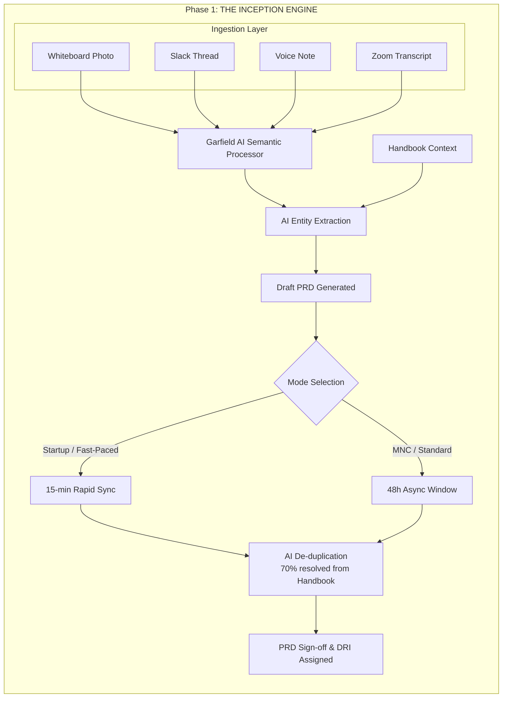
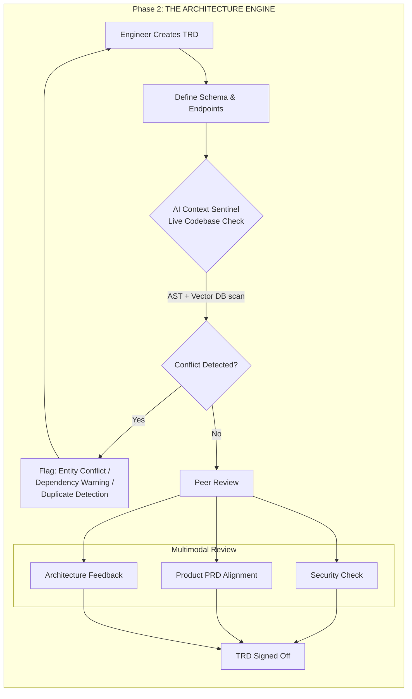
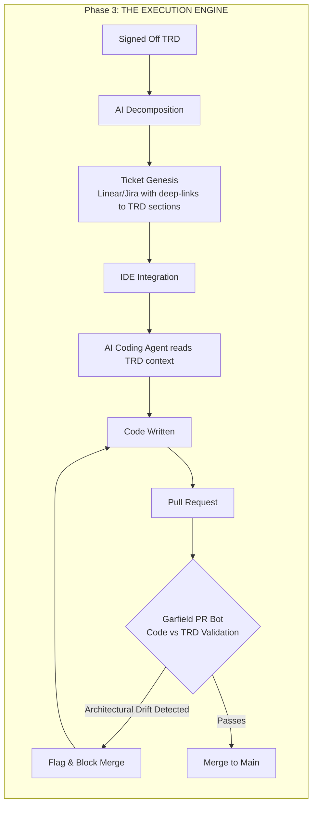
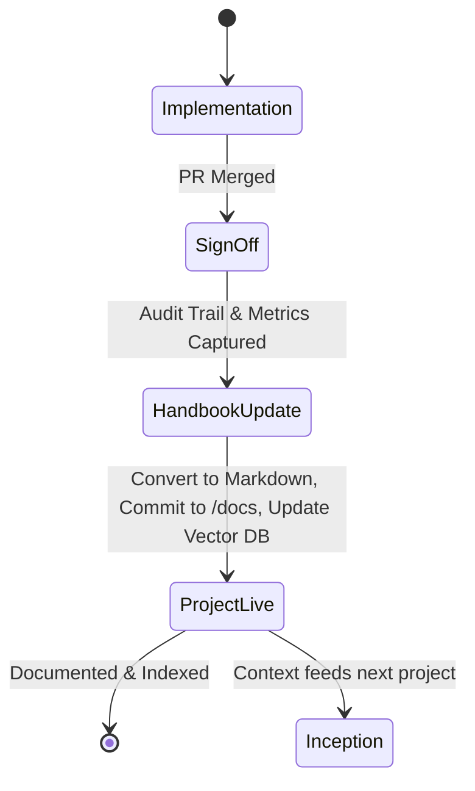
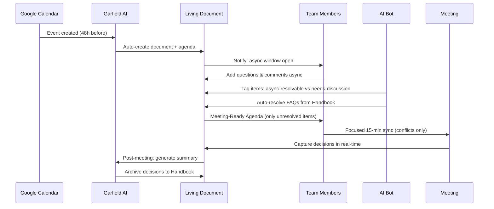
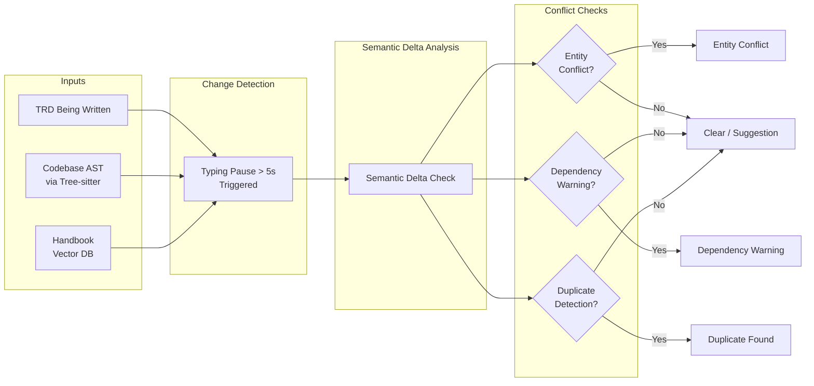
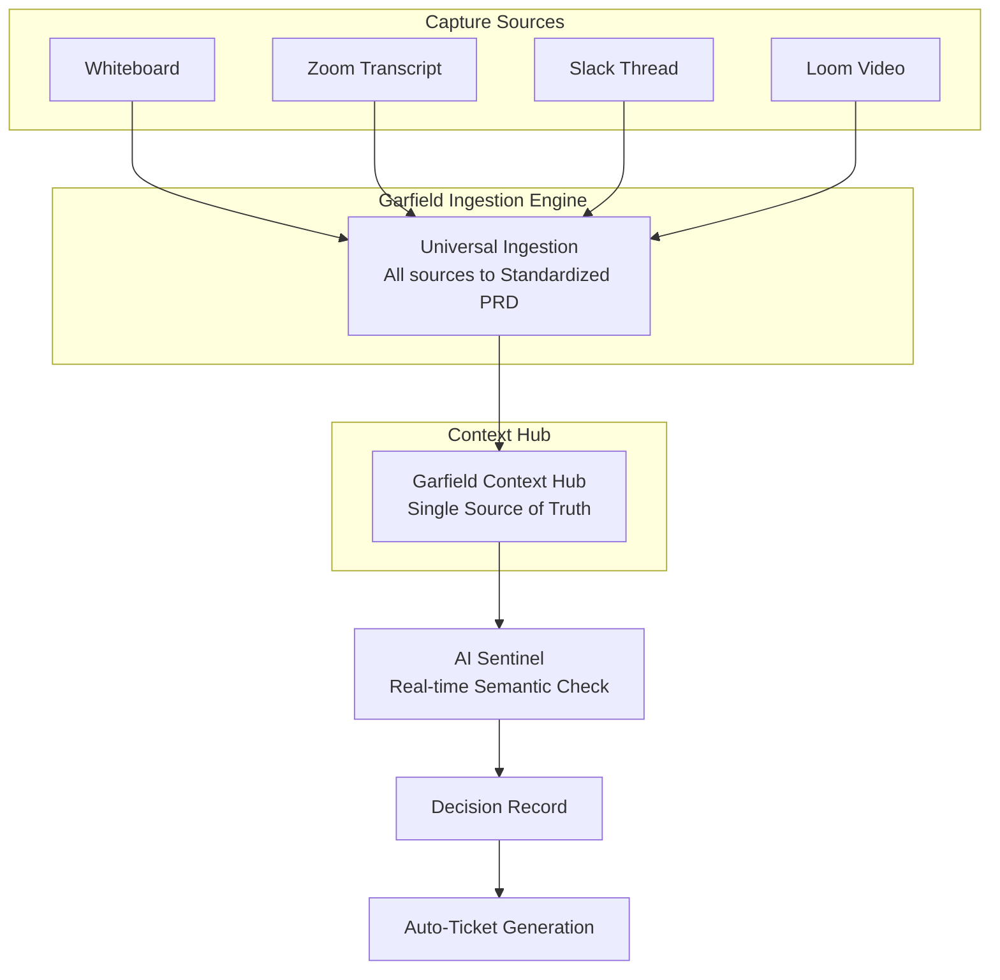

# Garfield: Building a Knowledge Ledger

Garfield is not an AI note-taker. It is a **Knowledge Ledger** for the engineering lifecycle — a system that captures, validates, and preserves every decision from ideation to production.

Where traditional tools treat documentation as a chore at the end, Garfield makes it a **byproduct of the process itself**. The result is "Code Reviews for PMs" — catching **Semantic Debt** at the source, before it becomes expensive bugs downstream.

> **Semantic Debt** is to product teams what Technical Debt is to codebases. Every meeting decision that isn't captured, every TRD written without codebase context, every ticket created without linking back to the "Why" — that's semantic debt accumulating silently.

This document describes the problem Garfield solves, how it solves it, and the technical architecture behind it.

---

## The Problem: How Companies Work Today

Modern engineering teams suffer from a broken lifecycle. Context leaks at every handoff, and decisions evaporate between phases.

### Inception: Ephemeral Context

A 1-hour meeting where 50% of the room is bored. Decisions happen verbally. Someone takes notes, but they're incomplete. The PM writes a PRD from memory three days later. Slack threads contain critical clarifications that nobody can find. Voice notes sit unlistened. Whiteboard photos are never digitized.

**Result**: The PRD reflects what the PM remembers, not what was decided.

### Architecture & Design: Isolationist TRDs

Engineers write Technical Requirements Documents in silos. The TRD references a service that was renamed two months ago. It proposes a schema that conflicts with an existing migration. Nobody catches it because the TRD reviewer skimmed it between meetings.

This creates **Architecture Drift** — the gap between what's designed and what actually exists in the codebase. It leads to "Code Review Surprises" where fundamental design issues surface only when the PR is already open.

### Execution: Copy-Paste Breakdown

The PM manually breaks down a TRD into Jira or Linear tickets. In translation, the "Why" and "How" are lost. The ticket says "implement notification batching" but doesn't link to the TRD section explaining the rate-limiting constraints. The developer guesses. The AI coding agent guesses harder.

**Result**: Developer uncertainty, context-poor implementation, and bugs that trace back to requirements, not code.

### Knowledge: The Documentation Graveyard

PRDs and TRDs are written, approved, and never looked at again. Six months later, a new engineer asks "why did we choose PostgreSQL over DynamoDB?" and nobody remembers. The handbook is stale. Onboarding takes weeks because institutional knowledge lives in people's heads, not in searchable documentation.

**Result**: Repeated decision-making, slow onboarding, and an organization that forgets faster than it learns.

---

## The Garfield Solution: Four Engines

Garfield addresses each broken phase with a dedicated engine. Together, they form a continuous loop where the output of each phase feeds the next.

### The Inception Engine (Ideation & Context Ingestion)

The Inception Engine replaces ephemeral meetings with structured capture.

**Capture-First Ingestion** — every interaction is a valid data source:
- Whiteboard photos (OCR + entity extraction)
- Slack threads (threaded context preservation)
- Zoom/Google Meet transcripts (speaker-tagged decisions)
- Voice notes (transcription + intent classification)

All inputs flow through the **Garfield AI Semantic Processor**, which extracts entities (features, constraints, stakeholders, dependencies) and cross-references them against the existing Handbook. A structured **Draft PRD** is generated automatically.

**Hybrid Mode Selection** adapts to the organization:

| Mode | Format | Output | AI Role |
|------|--------|--------|---------|
| Startup / Fast-Paced | 15-min Rapid Sync with live transcription | Immediate Draft PRD | Real-time entity extraction |
| MNC / Distributed | 48h Async Window via Slack/Teams | Draft PRD after async review | De-duplication + FAQ resolution |

**AI De-duplication** resolves ~70% of incoming questions from the existing Handbook before they become meetings. The remaining 30% form the agenda for focused synchronous discussion.

The phase ends with **PRD Sign-off** and a Directly Responsible Individual (DRI) assigned.

> **Implementation**: The transcript-to-spec pipeline (`pipeline/`) is the first concrete implementation of the Inception Engine. It takes diarized meeting transcripts and produces structured, agent-friendly specifications using a LangGraph-based agentic workflow with self-correction. See the [Transcript-to-Spec Pipeline Guide](./transcript-to-spec-pipeline.md) for details.

---

### The Architecture Engine (Design & Validation)

The Architecture Engine turns the TRD from a static document into a **living logic check**.

As the engineer writes a TRD, the **AI Context Sentinel** continuously parses the actual GitHub repository using Tree-sitter (AST parsing) and a Vector DB of indexed documentation. On every typing pause (>5 seconds), it performs a **Semantic Delta Check**:

- **Entity Conflict**: Does the referenced entity exist? Does it match the spec?
- **Dependency Warning**: "You referenced `NotificationService.sendBatch()` but that method doesn't exist in the current codebase."
- **Duplicate Detection**: "This pipeline logic already exists in `wire-pipeline-v2` — should you reuse it?"

After the Sentinel clears, the TRD enters **Multimodal Peer Review** across three tracks:
- **Security Check** — surface area and vulnerability assessment
- **Product PRD Alignment** — does the TRD implement what the PRD specified?
- **Architecture Feedback** — structural and pattern review from peers

The TRD is "Signed Off" only after all review tracks clear.

---

### The Execution Engine (Implementation & Tracking)

The Execution Engine eliminates the copy-paste breakdown between design and implementation.

**Semantic Ticket Genesis** — when a TRD is signed off, AI decomposes it into tickets that are **Context Blobs**, not flat descriptions. Each ticket contains:
- **The What**: Task description
- **The Why**: Deep-link to the originating PRD section
- **The How**: Deep-link to the specific TRD section
- **Constraints**: Referenced directly from the TRD

Tickets are created in Linear or Jira with deep-link URIs back to the TRD sections.

**IDE Integration** — AI coding agents (Cursor, GitHub Copilot, etc.) read TRD context through Garfield's integration, producing code that matches the original architecture intent rather than guessing from a one-line ticket description.

**Garfield PR Bot** — on pull request submission, the bot validates the code against the TRD logic. If the implementation deviates from the signed-off design (Architectural Drift), the bot flags and blocks the merge until the deviation is resolved or the TRD is amended.

---

### The Knowledge Engine (Governance & Archiving)

The Knowledge Engine prevents the Documentation Graveyard by making archiving automatic.

**Auto-Archive** — on PR merge, Garfield strips drafting noise from the TRD, converts it to clean Markdown, and commits it to the `/docs` folder. Documentation is a byproduct, not a chore.

**Self-Healing Brain** — the newly archived document is immediately indexed in the Vector DB. This closes the loop: the next time someone starts a new project (Phase 1), the Inception Engine's AI Semantic Processor can draw on this knowledge to answer questions, detect duplicates, and provide context.

**Audit Trail & Metrics** — captures SLA promised vs. actual delivery time. A Retrospective Doc is auto-generated comparing the original PRD timeline against reality.

The Knowledge Engine feeds directly back into the Inception Engine, creating a continuous learning loop.

---

## The Universal Lifecycle

All four engines connect in a continuous loop. The output of each phase is the input to the next, and the Knowledge Engine feeds back into Inception for the next project.

```mermaid
graph TD
    subgraph Phase_1["Phase 1: THE INCEPTION ENGINE"]
        direction TB
        IN_OFF[In-Office Session] & IN_REM[Remote / Async] & IN_DIR[Direct Input] --> GP[Garfield Processor]
        GP --> AEE[AI Entity Extraction]
        HB_CTX[Handbook Context] --> AEE
        AEE --> DPRD[Draft PRD]
        DPRD --> MODE{Mode?}
        MODE -->|Startup / Fast| FAST[15-min Rapid Sync]
        MODE -->|MNC / Scale| SLOW[48h Async Window]
        FAST & SLOW --> DEDUP[AI De-duplication<br/>70% from Handbook]
        DEDUP --> PRD_SO[PRD Sign-off & DRI]
    end

    subgraph Phase_2["Phase 2: THE ARCHITECTURE ENGINE"]
        direction TB
        TRD_C[Engineer Creates TRD] --> SCHEMA[Schema & Endpoints]
        SCHEMA --> SENT{AI Context Sentinel<br/>Codebase Check}
        SENT -->|Conflict| SENT_FL[Flag Conflict]
        SENT_FL --> TRD_C
        SENT -->|Clear| PEER[Peer Review]
        PEER --> SEC[Security] & PPRD[Product PRD] & PEERS[Architecture]
        SEC & PPRD & PEERS --> TRD_SO[Final TRD Approval]
    end

    subgraph Phase_3["Phase 3: THE EXECUTION ENGINE"]
        direction TB
        DECOMP[AI Decomposition] --> TICKETS[Linear/Jira Tickets<br/>with TRD deep-links]
        TICKETS --> IDE_INT[IDE Integration]
        IDE_INT --> AI_CODE[AI Coding Agent reads TRD]
        AI_CODE --> CODE[Code]
        CODE --> PR_VAL{Garfield PR Bot<br/>Drift Check}
        PR_VAL -->|Drift| DRIFT[Flag: Architectural Drift]
        DRIFT --> CODE
        PR_VAL -->|Valid| MERGE[Merge]
    end

    subgraph Phase_4["Phase 4: THE KNOWLEDGE ENGINE"]
        direction TB
        IMPL[Implementation Complete] --> SIGN[Sign-Off<br/>Audit Trail + Metrics]
        SIGN --> HB_UPD[Handbook Update<br/>Markdown to /docs<br/>Vector DB indexed]
        HB_UPD --> LIVE[Project Live & Documented]
    end

    Phase_1 -.-> Phase_2
    Phase_2 -.-> Phase_3
    Phase_3 -.-> Phase_4
    Phase_4 -.->|Context for next project| Phase_1

    style GP fill:#4A90D9,color:#fff
    style SENT fill:#E67E22,color:#fff
    style PR_VAL fill:#E67E22,color:#fff
    style HB_UPD fill:#27AE60,color:#fff
    style LIVE fill:#27AE60,color:#fff
```

---

## The Async-First Meeting Flow

Garfield transforms meetings from information-transfer sessions into focused conflict-resolution syncs. The bulk of alignment happens asynchronously before anyone enters a room.

**Pre-Meeting (48h before)**: Garfield auto-creates a document from the calendar event, suggests an agenda, and opens an async window. Team members add questions and comments. The AI tags items as "async-resolvable" vs "needs-discussion" and auto-resolves FAQs from the Handbook.

**During Meeting**: Only unresolved items make the agenda. A 15-minute focused sync replaces the 1-hour status update. Decisions are captured in real-time to the living document.

**Post-Meeting**: AI generates a summary, extracts action items, and archives decisions to the Handbook.

---

## The Context Sentinel Deep-Dive

The Context Sentinel is Garfield's real-time design validator. It operates during TRD authoring, analyzing every significant edit against three data sources.

**Inputs**:
- **TRD Being Written** — the live document content
- **Codebase AST** — parsed via Tree-sitter, focusing on interfaces, schemas, constants, and READMEs
- **Handbook Vector DB** — all approved PRDs and TRDs, indexed alongside code documentation

**Trigger**: Typing pause > 5 seconds (Chokidar locally, GitHub Webhooks in production)

**Outputs**:
- **Entity Conflict** (blocks TRD approval) — a referenced entity doesn't exist or doesn't match the spec
- **Dependency Warning** (surfaces for resolution) — e.g., "you referenced `NotificationService.sendBatch()` but that method doesn't exist"
- **Duplicate Detection** (surfaces for decision) — e.g., "this logic already exists in `wire-pipeline-v2`"
- **Clear** — no issues found, proceed with peer review

---

## Supporting Both Worlds: Startups & MNCs

Garfield uses a **Context-First Hybrid Model** that adapts to organizational speed without sacrificing quality.

### Startup Path

Phase 1 through Phase 3 can complete in a single afternoon. The 15-minute Rapid Sync produces an immediate Draft PRD. The AI Sentinel acts as a **safety net** — fast checks that don't block velocity but catch critical conflicts. Tickets are generated and development starts the same day.

### MNC Path

Each sign-off is a formal **Quality Gate** with SLA timers and full audit trails. The 48-hour Async Window ensures distributed stakeholders across time zones can participate. Compliance requirements are met through the Audit Trail in the Knowledge Engine.

### Context Parity

The key design principle: **"If it's not in Garfield, it didn't happen."**

The Universal Ingestion layer ensures that regardless of source — whiteboard, Zoom, Slack, or Loom — the output is a standardized PRD. This creates context parity between in-office and remote teams. The startup team that jams on a whiteboard produces the same structured artifact as the MNC team that threads a Slack discussion over 48 hours.

---

## The Transformation Summary

| Dimension | Standard Lifecycle | Garfield Lifecycle |
|---|---|---|
| **Meeting Goal** | Information transfer (status updates) | Conflict resolution only |
| **Source of Truth** | Loudest person in the room | Garfield Context Hub |
| **Bug Discovery** | Code Review / QA | TRD Design stage (Context Sentinel) |
| **Documentation** | Chore at project end | Byproduct of the process |
| **AI Utility** | Generic code completion | Context-aware architecture validation |

### Key Workflow Stages

| Stage | Description | AI Role |
|---|---|---|
| **Ingestion** | Capture all inputs, produce Draft PRD | Semantic Processor, Entity Extraction |
| **Sentinel** | Live TRD check vs codebase | Context Sentinel (AST + Vector DB) |
| **Genesis** | TRD decomposed into context-rich tickets | AI Decomposition |
| **Drift Check** | PR validation vs TRD | Garfield PR Bot |
| **Archiving** | Merge triggers Handbook update | Auto-archive + Vector DB indexing |

---

## Technical Architecture Overview

| Layer | Technology | Purpose |
|---|---|---|
| **Backend** | FastAPI (Python) | AI/LLM integration, async task handling |
| **Frontend** | Next.js (TypeScript) + Tailwind + Shadcn/UI | Dashboard, document editor |
| **Database** | PostgreSQL with pgvector | Structured data + semantic embeddings |
| **Document Editor** | TipTap | Rich-text editing with custom extensions |
| **LLM Orchestration** | LangChain or LlamaIndex | Prompt management, RAG pipelines |
| **Vector DB** | Pinecone / Milvus / Chroma | Handbook + codebase semantic indexing |
| **Change Detection** | Chokidar (local) / GitHub Webhooks (cloud) | Trigger Context Sentinel on edits |
| **Code Parsing** | Tree-sitter | AST parsing for Sentinel analysis |
| **Workflow Engine** | Temporal.io or XState | Document lifecycle state machine |
| **Calendar Sync** | Google Calendar API | Auto-create documents from events |
| **Ticket Integration** | Linear API / Jira API | Semantic Ticket Genesis |

---

## Implementation Roadmap

### Sprint 1: Living Doc & States

- TipTap editor with custom status dropdown
- Document state machine: `Draft → Review → Approved → In Progress → Under Review → Signed Off → Tickets Created`
- Visual status indicators on dashboard

### Sprint 2: SLA & Notification Engine

- Background worker for SLA countdown timers
- Color-coded urgency indicators (green / yellow / red)
- Auto-escalation when SLA is breached

### Phase 1: Context Sink (MVP)

- Google Calendar / Google Meet / Zoom sync
- Automatic Markdown document generation from meetings
- Basic PRD and TRD templates

### Phase 2: Async Threading

- Commenting system with semantic threading
- Semantic Highlighting — surfaces important discussions to editors
- AI quality checks at each state transition
- Template suggestions

### Phase 3: TRD Agent

- RAG pipeline over the codebase (Tree-sitter AST + Vector DB)
- Context Sentinel — real-time semantic delta analysis during TRD editing
- Handbook Mode — approved docs converted and indexed
- Decision Record extraction and cross-document linking

### Phase 4: The Bridge

- Linear / Jira integration for Semantic Ticket Genesis
- Garfield PR Bot (validates code vs TRD on PR submission)
- Auto-archive to `/docs` on merge
- Retrospective doc auto-generation
