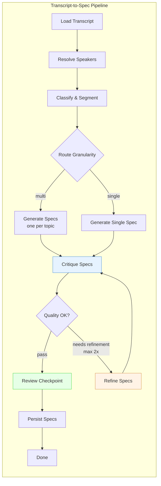

# Transcript-to-Spec Pipeline

Every meeting generates decisions, requirements, and action items — but most of it evaporates within hours. The Transcript-to-Spec Pipeline is Garfield's first concrete implementation of the [Inception Engine](./architecture.md#the-inception-engine-ideation--context-ingestion). It takes diarized meeting transcripts and converts them into structured, agent-friendly specifications that downstream LLM agents can use to generate TRDs, tickets, and code.

This is not summarization. It is **semantic extraction** — pulling out requirements, constraints, decisions, and action items from natural conversation, validating them against what was actually said, and packaging them in a format optimized for machine consumption.

---

## Where It Fits

```
Meeting Audio → Transcription & Diarization → [THIS PIPELINE] → Structured Specs → TRDs → Tickets → Code
                     (existing POC)              (pipeline/)        (specs/*.md)      (future)
```

The pipeline sits between the existing meeting capture POC (`pocs/meeting-transcripts/`) and the planned Architecture Engine. It implements the "Garfield AI Semantic Processor" described in the [architecture doc](./architecture.md).

---

## Architecture

The pipeline is built on [LangGraph](https://github.com/langchain-ai/langgraph) — a stateful graph framework for orchestrating LLM workflows. It uses 9 nodes connected in a directed graph with a bounded self-correction loop.



---

## How It Works

### 1. Load Transcript

Reads meeting metadata and transcript segments from SQLite via the existing `storage.get_transcript()` and `storage.get_meeting()` functions. No LLM call — pure data loading.

**Input**: `meeting_id`
**Output**: List of `{id, speaker, start, end, text}` segments + meeting title

### 2. Resolve Speakers

Maps anonymous labels (`SPEAKER_00`, `SPEAKER_01`) to real names using LLM inference. The model analyzes the transcript for clues:
- Direct address: "Hey John, what do you think?"
- Self-introduction: "I'm Sarah from the backend team"
- Role context combined with attendee list

Skips the LLM call if there's only one speaker. Only maps names it's confident about.

### 3. Classify & Segment

A single LLM call that performs two tasks simultaneously:
- **Classify** each segment as `spec_relevant`, `context_only`, or `noise`
- **Group** relevant segments into coherent topic clusters with titles

This combined approach reduces latency and avoids information loss between separate classification and grouping steps. Noise segments (small talk, greetings, off-topic chat) are filtered out.

### 4. Route Granularity

A conditional branch (no LLM) based on configuration:
- **`multi`** (default): Routes to `generate_specs` — produces one spec per detected topic
- **`single`**: Routes to `generate_single_spec` — consolidates everything into one document

### 5. Generate Specs

The core generation step. For each topic cluster (or all topics in single mode), makes an LLM call using Pydantic structured output to produce a `SpecOutput` with:
- Summary, requirements, constraints, acceptance criteria
- Decisions made, action items (with assignees), open questions
- Back-links to source transcript segments

### 6. Critique Specs

Self-critique step. Feeds the generated specs back to the LLM alongside the original transcript and asks:
- Does every requirement match what was actually discussed?
- Are there topics or requirements missing from the spec?
- Are there hallucinated details that weren't in the meeting?
- Are action items attributed to the right people?

Returns a quality rating: `pass`, `needs_refinement`, or `fail`.

### 7. Refine Specs

Targeted revision based on specific critique feedback. This is not regeneration from scratch — the LLM receives the existing specs plus the critique issues and fixes only what was flagged. The loop is bounded to **2 iterations maximum** to prevent runaway LLM costs.

### 8. Review Checkpoint

Optional human-in-the-loop gate. When `require_review=true`, the graph pauses here using LangGraph's `interrupt_before` mechanism. A human can inspect the specs and critique, then resume execution. When `require_review=false` (default), this is a passthrough.

### 9. Persist Specs

Writes each spec as a markdown file with YAML frontmatter to `specs/{meeting_id}/{topic-slug}.md`. Also inserts a record into the SQLite `specs` table linking the spec back to its meeting. Updates the meeting status to `done`.

---

## Output Format

Each spec is a structured markdown document:

```markdown
---
meeting_id: 1
topic: "User Authentication System"
participants: ["John", "Sarah", "Mike"]
generated_at: "2026-03-22T10:30:00+00:00"
---

# User Authentication System

## Summary

Team discussed implementing OAuth2 with JWT tokens for the new auth system.

## Requirements

- Support OAuth2 authorization code flow
- Issue JWT access tokens with 15-minute expiry
- Refresh tokens must be rotatable

## Constraints

- Must integrate with existing user database
- Cannot break backward compatibility with v1 API

## Acceptance Criteria

- [ ] User can log in via Google OAuth
- [ ] Access token refresh works silently
- [ ] Session persists across browser restarts

## Decisions Made

- Use Auth0 as the identity provider
- JWT over opaque tokens for stateless verification

## Action Items

- [ ] Set up Auth0 tenant — **John** (by 2026-03-25)
- [ ] Write migration script — **Sarah**
- [ ] Update API gateway config — **Mike**

## Open Questions

- Should we support SAML for enterprise clients?
- What's the token revocation strategy?
```

The underlying data model (`SpecOutput`) is a Pydantic model defined in `pipeline/state.py`.

---

## Configuration

All settings can be set via environment variables or passed directly to `run_pipeline()`.

| Environment Variable | Default | Options | Description |
|---------------------|---------|---------|-------------|
| `GARFIELD_LLM_PROVIDER` | `openai` | `openai`, `anthropic`, `google` | Which LLM provider to use |
| `GARFIELD_LLM_MODEL` | `gpt-4o` | Any model name for your provider | Model to use for all LLM calls |
| `GARFIELD_SPEC_MODE` | `multi` | `multi`, `single` | One spec per topic or consolidated |
| `GARFIELD_REQUIRE_REVIEW` | `false` | `true`, `false` | Pause for human review before persisting |
| `GARFIELD_SPECS_DIR` | `specs` | Any path | Output directory for spec markdown files |

### LLM Provider Setup

The pipeline supports three LLM providers. Set the appropriate API key:

```bash
# OpenAI
export OPENAI_API_KEY=sk-...

# Anthropic (Claude)
export ANTHROPIC_API_KEY=sk-ant-...

# Google (Gemini)
export GOOGLE_API_KEY=AI...
```

The provider factory in `pipeline/llm.py` handles instantiation. All providers use `temperature=0` for deterministic output.

---

## Usage

### Python API

```python
import sys
sys.path.insert(0, '.')
sys.path.insert(0, 'pocs/meeting-transcripts')

from pipeline.graph import run_pipeline

result = run_pipeline(
    meeting_id=1,                    # ID from meetings table
    llm_provider="google",           # or "openai", "anthropic"
    llm_model="gemini-2.0-flash",    # model name for your provider
    spec_mode="multi",               # "multi" or "single"
    require_review=False,            # set True to pause for human review
    specs_dir="specs",               # output directory
)

# Check results
if result.get("error"):
    print(f"Error: {result['error']}")
else:
    print(f"Generated {len(result['specs'])} spec(s)")
```

### Flask Web UI

Start the server:
```bash
cd pocs/meeting-transcripts
python app.py
```

Then:
1. Visit `http://localhost:8000/meetings/<id>` for any completed meeting
2. Click **"Generate Specs"** to trigger the pipeline
3. View generated specs via the links that appear

**Routes:**
- `POST /meetings/<id>/generate-specs` — Trigger pipeline for a meeting
- `GET /specs/<id>` — View a generated spec

### Automatic (Post-Transcription)

The pipeline runs automatically after `bot_worker.py` finishes transcribing a meeting. The meeting status flow is:

```
pending → recording → transcribing → generating_specs → done
```

Spec generation failures are non-fatal — the meeting is marked `done` regardless.

---

## Storage

Specs are dual-persisted for flexibility:

### Markdown Files

Written to `specs/{meeting_id}/{topic-slug}.md` with YAML frontmatter. These are:
- Git-friendly (can be committed and versioned)
- Human-readable (standard markdown)
- Machine-readable (YAML frontmatter for metadata)
- Easy for downstream LLM agents to consume

### SQLite Database

The `specs` table links specs back to meetings:

```sql
CREATE TABLE specs (
    id INTEGER PRIMARY KEY AUTOINCREMENT,
    meeting_id INTEGER NOT NULL,
    topic TEXT,
    spec_file_path TEXT,
    status TEXT DEFAULT 'draft',    -- draft | reviewed | approved
    created_at TEXT,
    graph_run_id TEXT,
    FOREIGN KEY (meeting_id) REFERENCES meetings(id)
);
```

**CRUD functions** in `storage.py`: `insert_spec()`, `get_specs_for_meeting()`, `get_spec()`, `update_spec_status()`

---

## Extending the Pipeline

### Adding a Node

1. Create a new file in `pipeline/nodes/` following the pattern:
```python
from pipeline.state import PipelineState

def my_node(state: PipelineState) -> dict:
    # Read from state, do work, return updates
    return {"my_new_field": result}
```

2. Add the node to the graph in `pipeline/graph.py`:
```python
workflow.add_node("my_node", my_node)
workflow.add_edge("previous_node", "my_node")
```

3. Add any new state fields to `PipelineState` in `pipeline/state.py`.

### Modifying Prompts

All LLM prompts live in `pipeline/prompts/`. Each file has a `_SYSTEM` constant (system message) and a `_USER` constant (user message template with `{placeholders}`). Edit these to tune output quality.

### Changing the Output Format

Modify the `SpecOutput` Pydantic model in `pipeline/state.py`. The LLM's structured output will automatically conform to the new schema. Update `_spec_to_markdown()` in `pipeline/nodes/persist.py` to render any new fields.

---

## Troubleshooting

| Issue | Cause | Fix |
|-------|-------|-----|
| Empty `speaker_map` | Single speaker in meeting, or LLM couldn't identify names | Normal for solo recordings. For multi-speaker, check if attendees are available |
| "No spec-relevant topics found" | Meeting was all noise/small talk | Expected for non-technical meetings. The pipeline exits gracefully |
| Specs seem incomplete after refinement | Refinement loop capped at 2 iterations | Re-run the pipeline, or switch to a more capable model |
| Critique always returns "pass" | Model not being critical enough | Adjust the critique prompt in `pipeline/prompts/critique.py` |
| Provider error | Missing API key | Set the appropriate env var (`OPENAI_API_KEY`, `ANTHROPIC_API_KEY`, `GOOGLE_API_KEY`) |

---

## Technical Stack

| Component | Technology |
|-----------|------------|
| Graph Framework | LangGraph (StateGraph) |
| LLM Abstraction | LangChain Core (BaseChatModel) |
| Structured Output | Pydantic v2 |
| State Persistence | LangGraph MemorySaver |
| Database | SQLite (via existing `storage.py`) |
| Web Interface | Flask (via existing `app.py`) |
| LLM Providers | OpenAI, Anthropic, Google (via langchain-*) |
